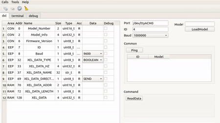

# Getting Start

## Install dependancies
#### Install microRTPSAgent
Please refer to [this link](https://micro-rtps.readthedocs.io/en/latest/installation.html#installing-the-agent-stand-alone) for detail install information.

- Install microRTPSAgent stand alone on your SBC or PC. (Linux)
```bash
$ sudo apt update
$ sudo apt install build-essential cmake git

# If you have ROS2 installed on your PC, you do not need to install FastRTPS.
$ git clone https://github.com/eProsima/Fast-RTPS
$ mkdir Fast-RTPS/build && cd Fast-RTPS/build
$ cmake -DTHIRDPARTY=ON ..
$ sudo make install
$ cd ../..

$ git clone https://github.com/eProsima/micro-RTPS-agent.git
$ mkdir micro-RTPS-agent/build && cd micro-RTPS-agent/build
$ cmake -DTHIRDPARTY=ON -DCONFIG_UDP_TRANSPORT_MTU=4096 ..
$ sudo make install
$ cp ./DEFAULT_FASTRTPS_PROFILES.xml ~/
$ sudo ldconfig /usr/local/lib/
```

## Change XEL's information using XEL Manager(GUI)
With XELManager, you can change the XEL ID, change the name and type of the topic.
You must have DYNAMIXEL(DXL) bypass device (like U2D2).
But, CommXEL have DXL bypass feature, so you can change CommXEL mode and use it.

The Alpha version includes the following features: (Not yet released)

- Search connected Xels(only SensorXEL, PowerXEL, DYNAMIXEL)
- Change XEL's ID, communication speed(Serial baudrate).
- Change data type, data direction(send/receive), ROS2 topic name, publish interval(hz)
- Read XEL's infomation(ID, model number, baudrate, data information, data, etc...)


<center>(Alpha test version)</center>


#### Download XEL Manager
```
$ git clone https://github.com/ROBOTIS-GIT/XelNetwork_Manager.git	
``` 
It is support Linux and Windwos. So you can choose an excutable for your OS.

- Linux
```
$ sudo chmod +x "YOUR_COMMXEL_PORT"    #if necessary
$ cd ./XelNetwork_Manager/excutable/linux
$ ./XELManager
```

- WIndows
```
cd ./XelNetwork_Manager/excutable/win
./XELManager
```

#### How to change CommXEL mode
|user button pressed time(n sec)|mode|
|:-:|:-:|
|1 > n|Normal|
|5> n > 1|DXL bypass|
|5 < n|Control Table Access|

#### How to scan XELs

- Change mode

|XEL|CommXEL mode|
|:-:|:-:|
|SensorXEL|DXL bypass|
|PowerXEL|DXL bypass|
|DYNAMIXEL|DXL bypass|
|CommXEL|Control Table Access|

- Click [Ping] button on XEL Manager.
*CAUTION: If XEL's ids are duplicated, you must change ID(Just connected 1 XEL) before ping.* 

#### How to change XEL's information
Features not described here are not supported.

 -  Connect XEL Network (PowerXEL, CommXEL, SensorXELs)
 - Connect USB cable (CommXEL -- PC)
 - Change CommXEL mode (DXL bypass or Control Table Access)
 - Click [Ping] button
 - Select XEL ID in [common] box
 - Click [ReadData] or double-click XEL ID in [common] box
 - Check XEL's information on XEL tab
 - Change value(only RW) on XEL tab when you want changing values
 
 
 
## Run XEL Network
- Run microRTPSAgent
```bash
$ cd
$ MicroRTPSAgent udp 2018
```
- Connect power to powerXel
- Connect commXel to powerXel
- Power on powerXel
- Connect sensorXels (There is no problem to proceed before PowerXEL power on)

#### Check topics using ROS2 or DDS application
```bash
#If you use ROS2
$ ros2 topic list -t
$ ros2 topic echo (your topic name)
```

## Update Firmware
In the future, we will add firmware update function on GUI.
But, currently, you must use command line.
	
#### Download update program
```
#if you don't download previous, download it using command below
$ git clone https://github.com/ROBOTIS-GIT/XelNetwork_Manager.git	
``` 
It is support Linux and Windwos. So you can choose a downloader for your OS.

*CAUTION : Before upload sensorXEL or powerXEL firmware, you must change commXEL mode to DXL bypass. On the other hand, you must change commXEL mode to normal before upload commXEL firmware.*

- Linux
```
$ sudo chmod +x "YOUR_COMMXEL_PORT"    #if necessary
$ cd ./XelNetwork_Manager/downloader
$ ./fw_update.sh <PORT> <Model Name>
 ex) ./fw_update.sh /dev/ttyACM0 sensorXEL
```

- WIndows
```
cd ./XelNetwork_Manager/excutable/win
./fw_update.bat <PORT> <Model Name>
 ex) ./fw_update.bat /dev/ttyACM0 sensorXEL
```

