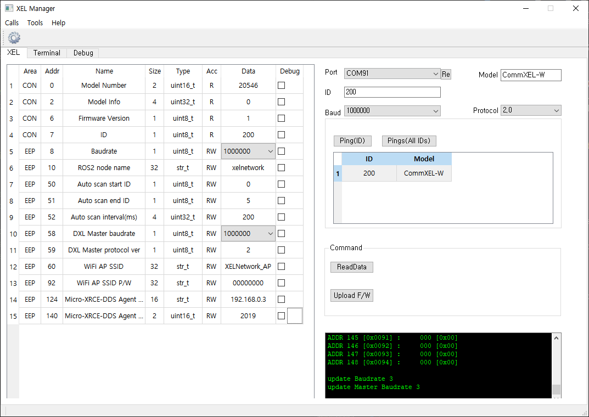

# Getting Start

## Install dependancies

In the Arduino environment, we use the ros2arduino library. And this library uses eProsima's Micro-XRCE-DDS Client library to use DDS service.

Micro-XRCE-DDS consists of Client and Agent, and Agent acts as a bridge between Client and FastRTPS (ROS2).
And there are several dependencies between them, so you need to install each version correctly before you can use it.

XELNetwork supports the Arduino environment, and Arduino uses a library called [ros2arduino](https://github.com/ROBOTIS-GIT/ros2arduino). In addition, version information is indicated in the manual of this library, so please use this as a guide.

#### Install Micro-XRCE-DDS Agent
Please refer to [this link](https://micro-xrce-dds.readthedocs.io/en/latest/installation.html#installing-the-agent-stand-alone) for detail install information.

- Install microRTPSAgent stand alone on your SBC or PC. (Linux)
```bash
$ sudo apt update
$ sudo apt install build-essential cmake git

# When you download this you must select the appropriate version.
$ git clone https://github.com/eProsima/Micro-XRCE-DDS-Agent.git -b <Tag_Version>
$ cd Micro-XRCE-DDS-Agent
$ mkdir build && cd build
$ cmake ..
$ make
$ sudo make install
$ sudo ldconfig /usr/local/lib/
```

## Change CommXEL's information using XEL Manager(GUI)
With XELManager, you can change the XEL ID, change the node name and baudrate and network infos.

The Beta version includes the following features:

- Search connected CommXEL-W
- Change XEL's ID, communication speed(Serial baudrate).
- Change ROS2 node name, scan range for PnP, network infos.


<center>(Beta test version)</center>


#### Download XEL Manager
```
$ git clone https://github.com/ROBOTIS-GIT/XelNetwork_Manager.git	
``` 
It is support Linux and Windwos. So you can choose an excutable for your OS.

- Linux
```
$ sudo chmod +x "YOUR_COMMXEL_PORT"    #if necessary
$ cd ./XelNetwork_Manager/excutable/linux
$ ./XELManager
```

- WIndows
```
cd ./XelNetwork_Manager/excutable/win
./XELManager
```

#### How to change CommXEL-W mode
|user button pressed time(n sec)|mode|note|
|:-:|:-:|:-:|
|1 > n > 0.1|XELNetwork PnP|ROS2|
|n >= 1|USB to DXL bypass|It is set to the baud rate of Master(DXL) and Slave(USB) set in the manager.|

#### How to change CommXEL-W's configuration.
Features not described here are not supported.

 - Connect USB cable (CommXEL-W -- PC)
 - Change CommXEL mode (XELNetwork PnP mode)
 - Select the correct port, Baud and Protocol version.
 - Enter the ID and click [Ping] or click [Pings].
 - Select XEL ID in [common] box
 - Click [ReadData] or double-click XEL ID in [common] box
 - Check XEL's information on XEL tab
 - Change value(only RW) on XEL tab when you want changing values
 
## Run XEL Network
- Run microRTPSAgent
```bash
$ cd
$ MicroRTPSAgent udp 2018
```
- Connect power to powerXel
- Connect commXel to powerXel
- Power on powerXel
- Connect sensorXels (There is no problem to proceed before PowerXEL power on)

#### Check topics using ROS2 or DDS application
```bash
#If you use ROS2
$ ros2 topic list -t
$ ros2 topic echo (your topic name)
```

## Update Firmware
In the future, we will add firmware update function on GUI.
But, currently, you must use command line.
	
#### Download update program
```
#if you don't download previous, download it using command below
$ git clone https://github.com/ROBOTIS-GIT/XelNetwork_Manager.git	
``` 
It is support Linux and Windwos. So you can choose a downloader for your OS.

*CAUTION : Before upload sensorXEL or powerXEL firmware, you must change commXEL mode to DXL bypass. On the other hand, you must change commXEL mode to normal before upload commXEL firmware.*

- Linux
```
$ sudo chmod +x "YOUR_COMMXEL_PORT"    #if necessary
$ cd ./XelNetwork_Manager/downloader
$ ./fw_update.sh <PORT> <Model Name>
 ex) ./fw_update.sh /dev/ttyACM0 sensorXEL
```

- WIndows
```
cd ./XelNetwork_Manager/excutable/win
./fw_update.bat <PORT> <Model Name>
 ex) ./fw_update.bat /dev/ttyACM0 sensorXEL
```

