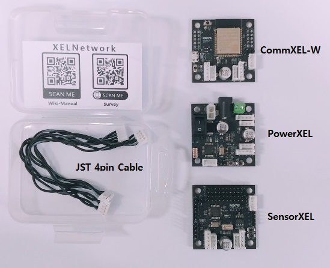

# 시작하기

이 문서는 한국 베타테스터를 위한 매뉴얼 문서입니다.

---
## 개요

베타테스터 여러분, 환영합니다.

XELNetwork는 (DYNAMI)XEL 프로토콜을 사용한 네트워크를 구축하기 위해 만들어졌습니다. 특히, 저렴한 시리얼 인터페이스(TTL/RS485) 기반으로 플러그 앤 플레이(약칭, PnP)를 가능케 함으로써 보다 편리한 개발방식을 시도해 보는 것이 1차 목표였습니다.
따라서, 베타테스터 패키지의 구성은 PnP기능을 위함이며 이는 ROS2의 토픽을 자동생성하는 예제를 포함하고 있습니다. 이 매뉴얼은 이를 위한 가이드문서이며, 유저가 이 외의 기능을 활용해보거나 직접 개발할 수 있는 환경 구축에 대한 내용을 포함하고 있습니다.

---

## 패키지 구성

- 베타테스터 패키지 구성
    - CommXEL-W * 1ea
    - PowerXEL * 1ea
    - SensorXEL * 1ea
    - JST 4핀케이블 * 2ea 
- 하드웨어 스펙 및 핀맵은 [**hardware**](hardware.md)페이지 참조




---
## 의존성 설치

### ROS2
아래 문서를 참조하여 설치. (현재는 Dashing을 추천)
- [ROS2 설치 위키](https://index.ros.org/doc/ros2/Installation/Dashing/#installing-ros-2-dashing-diademata)

### Micro-XRCE-DDS Agent
ROS2(DDS, FastRTPS)와 통신하는데 사용.
자세한 내용은 ROS2의 DDS관련 자료 및 FastRTPS, XRCE-DDS 문서를 참조.

설치 방법에 대한 세부적인 내용은 [eProsima의 공식 매뉴얼](https://micro-xrce-dds.readthedocs.io/en/latest/installation.html#installing-the-agent-stand-alone)을 참조.
Agent 버전은 ROS2 버전(FastRTPS 버전)에 의존적이기 때문에, 사용하는 ROS2버전에 따라 Agent를 설치.
이와 관련된 내용은 [ros2arduino의 README](https://github.com/ROBOTIS-GIT/ros2arduino#version-specific-dependencies)를 참조.

아래는 베타테스터 패키지 펌웨어 및 ROS2 Dashing Patch4(혹은 ROS2 Eloquent) 기준.
```bash
$ sudo apt update
$ sudo apt install build-essential cmake git
# When you download this you must select the appropriate version.
$ git clone https://github.com/eProsima/Micro-XRCE-DDS-Agent.git -b 1.1.5
$ cd Micro-XRCE-DDS-Agent
$ mkdir build && cd build
$ cmake ..
$ make
$ sudo make install
$ sudo ldconfig /usr/local/lib/
```
---
## CommXEL-W 설정 (with XELNetwork Manager)
XELNetwork Manager라는 GUI툴을 통해 CommXEL-W의 설정 변경 가능.

### 다운로드 및 실행
```bash
$ git clone https://github.com/ROBOTIS-GIT/XelNetwork_Manager.git
```
- `XelNetwork_Manager/excutable`에서 자신의 OS에 맞는 폴더의 `XELNetwork_Manager` 실행
    - Windows: /win/XELNetwork_Manager.exe
    - Linux: /linux/XELNetwork_Manager
        - Linux의 경우, 포트(/dev/ttyUSBx)에 대한 권한을 허용해야 할 수 있습니다. 
        - `chmod` 혹은 `sudo usermod -a -G tty username` 사용할 것)
    - MacOS: 지원 안함
- 혹은 아래 커맨드 실행
    - Linux
```bash
  $ sudo usermod -a -G tty username    #필요한 경우 실행, username은 자신의 계정이름으로 변경
  $ cd ./XelNetwork_Manager/excutable/linux
  $ ./XELManager
```

### 설정 변경하기
DYNAMIXEL의 컨트롤 테이블 방식.


- 기본 동작
    - 올바른 **Port**와 **Baud**(rate), **Protocol** 버전을 선택합니다.
    - **ID** 입력란에 올바른 ID(기본값 200)를 입력하고 [**Ping(ID)**] 버튼을 클릭하거나, ID와 상관 없이 모든 ID에 대해 검색을 하고 싶다면 [**Pings(All IDs)**] 버튼을 클릭합니다.
    - Ping에 대한 응답이 정상적으로 이루어졌다면, [**Ping**] 버튼 아래의 박스에 연결된 장치가 나타납니다.
    - 이 장치를 더블클릭하거나, 클릭 후 **Command** 박스의 [**ReadData**] 버튼을 클릭하여 컨트롤 테이블을 읽습니다.
    - 화면 왼쪽의 컨트롤 테이블에서 정보를 확인하거나 원하는 값으로 변경합니다.

- 무선 네트워크 설정 (필수)
    - Agent와 통신을 하기 위해, CommXEL-W의 무선 네트워크 설정을 해야 합니다.
    - **12~15**의 아이템들을 변경해야 합니다. (예시: 위 이미지)
    - 14번(주소 124)의 경우, 위에서 Agent를 설치한 PC의 IP주소를 입력합니다.

- 컨트롤 테이블

    |주소|크기(Byte)|명칭|내용|
    |:-:|:-:|:-:|:-:|
    |0|2|**Model Number**|DYNAMIXEL 프로토콜에서 컨트롤테이블을 구분하기 위해 사용하는 모델 번호|
    |2|4|**Model Info**|모델에 대한 추가 정보를 기록할 때 사용 (비활성화)|
    |6|1|**Firmware Version**|펌웨어 버전|
    |7|1|**ID**|DYNAMIXEL 프로토콜에서 사용되는 ID|
    |8|1|**Baudrate**|CommXEL-W의 USB와 연결되어 있는 UART의 속도. GUI및 Bypass모드에 영향을 주며, 이 값이 변경된다면 GUI Port의 Baud도 **동일하게** 설정해야 함|
    |10|32|**ROS2 node name**|ROS2에서 사용할 노드 이름 (`ros2 node list` 명령어로 확인 가능)|
    |50|1|**Auto scan start ID**|검색할 ID 범위의 시작값. PnP기능 사용 시, 주기적으로 CommXEL과 연결된 장치(SensorXEL, PowerXEL)를 검색하는데 사용됨|
    |51|1|**Auto scan end ID**|검색할 ID 범위의 마지막값. `Auto scan start ID`와 동일한 기능이며, 이 ID를 검색한 후 다시 `Auto scan start ID`부터 순차적으로 검색.|
    |52|4|**Auto scan interval(ms)**|PnP기능을 위한 자동 검색주기이며 단위는 milliseconds(ms). 이 주기마다 하나의 ID에 대해 검색|
    |58|1|**DXL Master baudrate**|CommXEL-W의 DYNAMIXEL포트의 속도. 연결된 장치들(SensorXEL, PowerXEL)과 동일해야 함|
    |59|1|**DXL Master protocol ver**|DYNAMIXEL 프로토콜의 버전. 연결된 장치들과 동일해야 함|
    |60|32|**WiFi AP SSID**|CommXEL-W가 연결할 AP(Access Point, 무선라우터)의 SSID|
    |92|32|**WiFi AP SSID P/W**|AP 접속 비밀번호|
    |124|16|**Micro-XRCE-DDS Agent IP**|Agent가 설치된 PC의 IP주소|
    |140|2|**Micro-XRCE-DDS Agent Port**|Agent에서 오픈한 Port번호|

---

## 하드웨어 연결

- Power(Max 24V) - PowerXEL - SensorXEL - CommXEL - USB(필요시)


---

## 데모 코드 동작 확인

### Agent 실행을 위한 기본설정파일 다운로드
- [다운로드 링크]()
- 관련 세부 내용은 [여기](https://github.com/ROBOTIS-GIT/ros2arduino#appendix-how-to-configure-entities-from-reference-file-available-at-011-or-above)

### Agent 실행
- 위에서 기본 설정파일을 다운로드한 위치로 이동
- 네트워크 설정에 맞게 옵션주어 실행
```bash
  $ MicroXRCEAgent udp -p 2019 -r xelnetwork_default.xml.refs
```
- 자세한 사용법에 관해서는 아래 명령어 혹은 [`링크`](https://github.com/ROBOTIS-GIT/ros2arduino#appendix-how-to-configure-entities-from-reference-file-available-at-011-or-above) 확인
```bash
  $ MicroXRCEAgent -h
```

---

## 부가 기능

### 


---

# 

## 개발환경 구축
