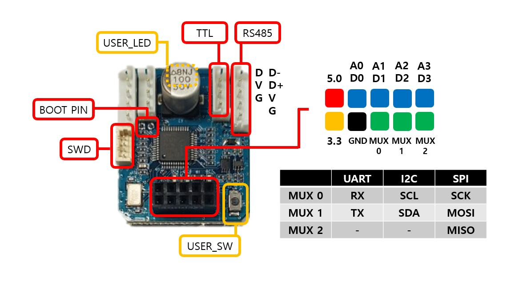
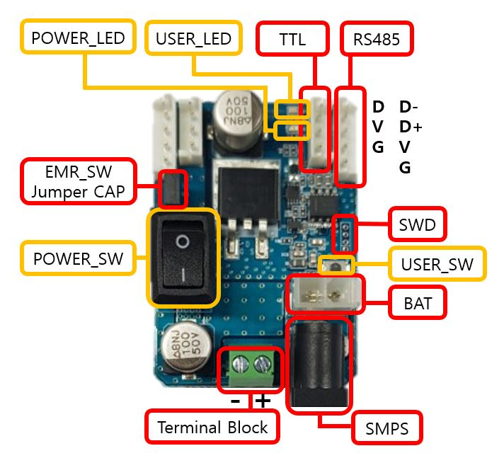
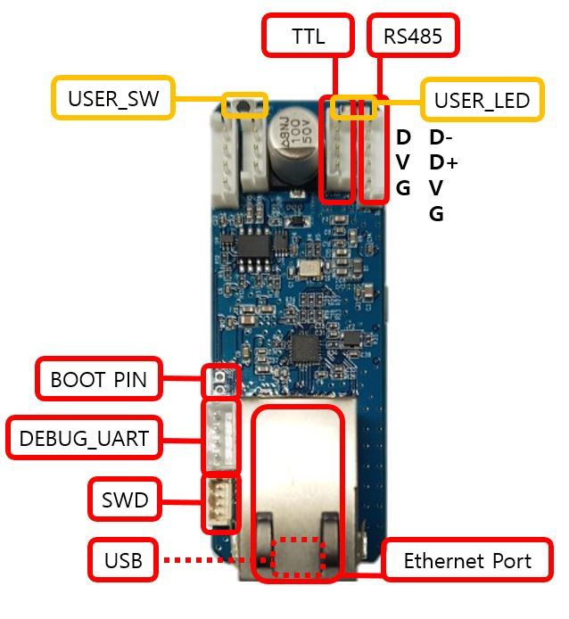

# OpenHardware

 

## Specification
#### SensorXel

  -  It supports 5.0V, 3.3V, GND through 2x5 connector. In addition, four ADC channels are supported, and the real-time pin-to-pin changeover is done in software via three MUXs, which are SensorXel's greatest features. The three pins (MUX 0, 1, 2) to which the MUX is connected can be changed to the configuration pins of the UART, I2C, and SPI, respectively, but now the pin function for each communication method is fixed as shown in the table above.
  - The voltage level of each data pin is 3.3V.
  - USER_LED can be controlled by the user as desired.
  
|Item|Description|
|:-:|:-:|
|MPU | STM32L151C8T6-A|
|Operation Voltage/Current | 12V ~ 24V / MAX 10A|
|I/O Voltage | 3.3V(500mA)|
|Flash | 64KB|
|SRAM | 32KB|
|EEPROM | 4KB|
|Clock | 32MHz|
|USART | 2/3|
|SPI | 1/2|
|I2C | 1/2|
|Debug | SWD, UART|
|Dynamixel Connector | TTL x 2 / RS-485 x 2 (JST)|
|Power | Dynamixel Connector|
|Dimensions | 34mm x 28.5mm|

 
#### PowerXel

  - The main function is power management. It is possible to shut off the power of TTL and RS485 by software and monitor the power and current supplied from external power source in 0.01V, 0.1A unit.
  - External power can be connected via SMPS, Terminal Block, and BAT connector. At this time, the recommended maximum voltage is 24V.
  - For immediate power off, Jumper CAP is inserted in 2-pin so that Emergency Switch can be attached. To use the Emergency Switch, you need to provide Jumper CAP and connect it to both pins.

|Item|Description|
|:-:|:-:|
|MPU | STM32L151C8T6-A|
|Operation Voltage/Current | 12V ~ 24V / MAX 10A|
|Flash | 64KB|
|SRAM | 32KB|
|EEPROM | 4KB|
|Clock | 32MHz|
|USART | 1/3|
|Debug | SWD|
|Dynamixel Connector | TTL x 2 / RS-485 x 2 (JST)|
|Power | Dynamixel Connector, SMPS, Terminal block|
|Dimensions | 48mm x 34mm|

 
#### CommXel

  - It is an important part of creating and processing topics from XelNetwork to ROS 2, and it features an Ethernet port and a USB port.

|Item|Description|
|:-:|:-:|
|MPU | STM32F746ZGT6|
|Operation Voltage/Current | 12V ~ 24V / MAX 10A|
|Flash | 1MB|
|SRAM | 320KB|
|Clock | 216MHz|
|ETHERNET | 1/1|
|USB | 1/1|
|USART | 2/4|
|Debug | SWD, USART|
|Dynamixel Connector | TTL x 2 / RS-485 x 2 (JST)|
|Power | Dynamixel Connector|
|Dimensions | 70mm x 26mm|
