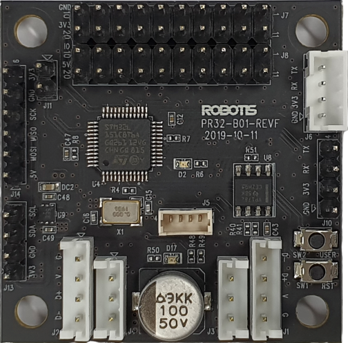
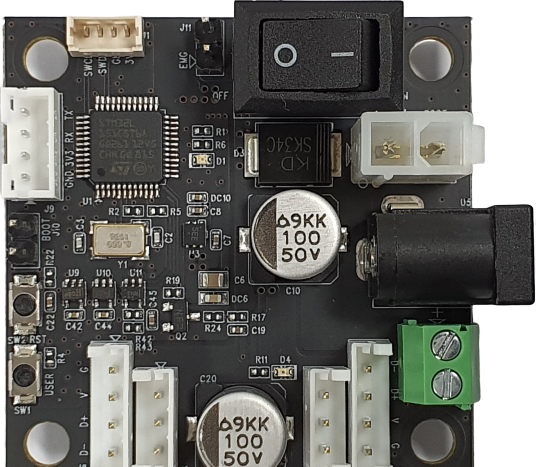
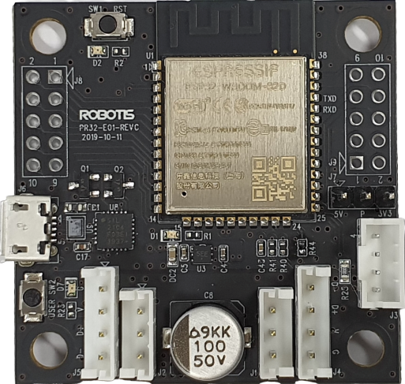
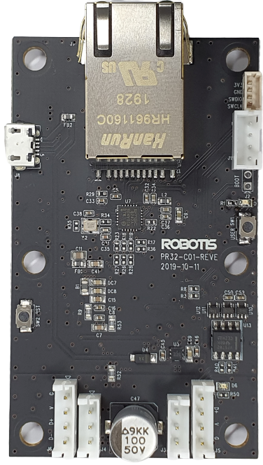
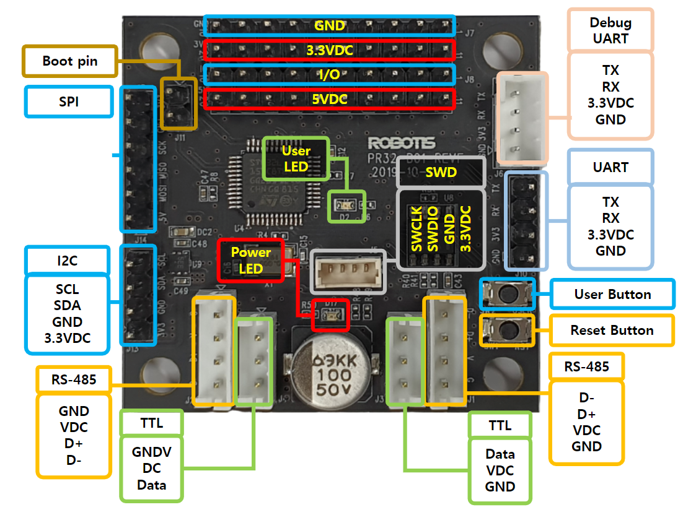
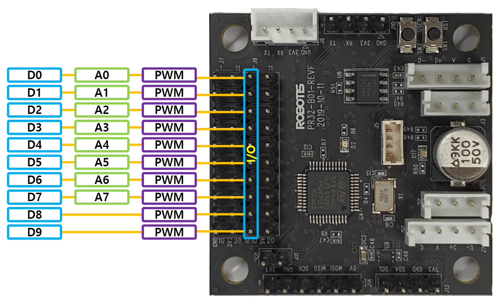
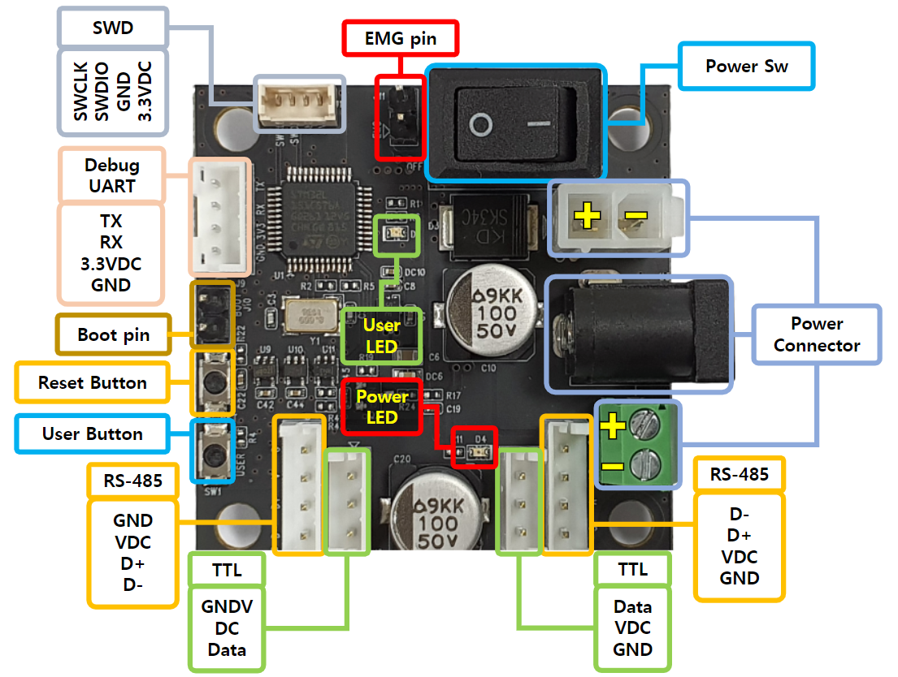
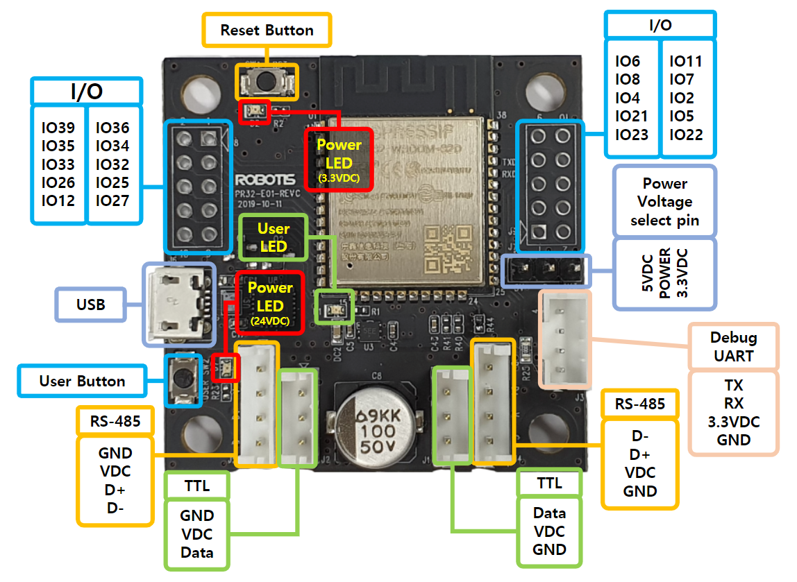
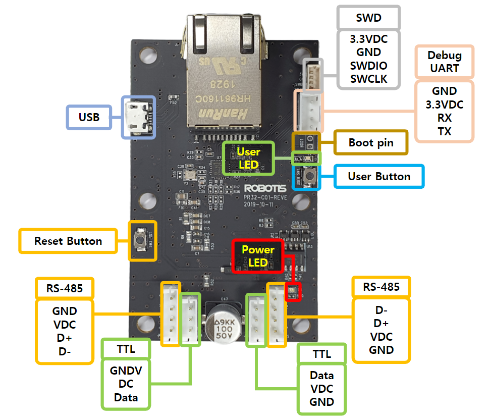

# OpenSource Hardware

## Git Repositories
- [hardware (Schematic, Gerber, CAD, BOM)](https://github.com/ROBOTIS-GIT/XelNetwork_Hardware)

---

## Specification
### SensorXEL

  
|Item|Description|
|:-:|:-:|
|MPU | STM32L151C8T6-A|
|Operation Voltage/Current | 12V ~ 24V / MAX 10A|
|I/O Voltage | 3.3V(500mA)|
|Flash | 64KB|
|SRAM | 32KB|
|EEPROM | 4KB|
|Clock | 32MHz|
|USART | 3/3|
|SPI | 1/2|
|I2C | 1/2|
|Debug | SWD, USART|
|Dynamixel Connector | TTL x 2 / RS-485 x 2 (JST)|
|Power | Dynamixel Connector|
|Dimensions | 44mm x 44mm|

 

### PowerXEL

  - The main function is power management. It is possible to shut off the power of TTL and RS485 by software and monitor the power and current supplied from external power source in 0.01V, 0.1A unit.
  - External power can be connected via SMPS, Terminal Block, and BAT connector. At this time, the recommended maximum voltage is 24V.
  - For immediate power off, Jumper CAP is inserted in 2-pin so that Emergency Switch can be attached. To use the Emergency Switch, you need to provide Jumper CAP and connect it to both pins.

|Item|Description|
|:-:|:-:|
|MPU | STM32L151C8T6-A|
|Operation Voltage/Current | 12V ~ 24V / MAX 10A|
|Flash | 64KB|
|SRAM | 32KB|
|EEPROM | 4KB|
|Clock | 32MHz|
|USART | 2/3|
|Debug | SWD, USART|
|Dynamixel Connector | TTL x 2 / RS-485 x 2 (JST)|
|Power | Dynamixel Connector, SMPS, Terminal block|
|Dimensions | 44mm x 48mm(w/o.USB 44)|

#### CommXEL-W

  - It is an important part of creating and processing topics from XEL Network to ROS 2, and it features WiFi.

|Item|Description|
|:-:|:-:|
|MPU | [ESP32 WROOM 32D](https://www.espressif.com/en/products/hardware/esp32/overview)|
|Operation Voltage/Current | 12V ~ 24V / MAX 10A|
|Flash | SPI 4MB|
|SRAM | 520KB|
|Clock | 240MHz|
|WiFi | 1/1|
|BLE | 1/1|
|USART | 3/3|
|Debug | USART|
|External I/O | 20/40|
|Dynamixel Connector | TTL x 2 / RS-485 x 2 (JST)|
|Power | Dynamixel Connector|
|Dimensions | 44mm x 45mm(w/o.USB 44)|

 

#### CommXEL

  - It is an important part of creating and processing topics from XEL Network to ROS 2, and it features an Ethernet port and a USB port.

|Item|Description|
|:-:|:-:|
|MPU | STM32F746ZGT6|
|Operation Voltage/Current | 12V ~ 24V / MAX 10A|
|Flash | 1MB|
|SRAM | 320KB|
|Clock | 168Mhz for baudrate (up to 216MHz)|
|ETHERNET | 1/1|
|USB | 1/1|
|USART | 2/4|
|Debug | SWD, USART|
|Dynamixel Connector | TTL x 2 / RS-485 x 2 (JST)|
|Power | Dynamixel Connector|
|Dimensions | 76.7mm x 45mm(w/o.USB 44)|

---

## PinMap

### SensorXEL

 

### PowerXel

 

### CommXEL-W

 

### CommXEL
