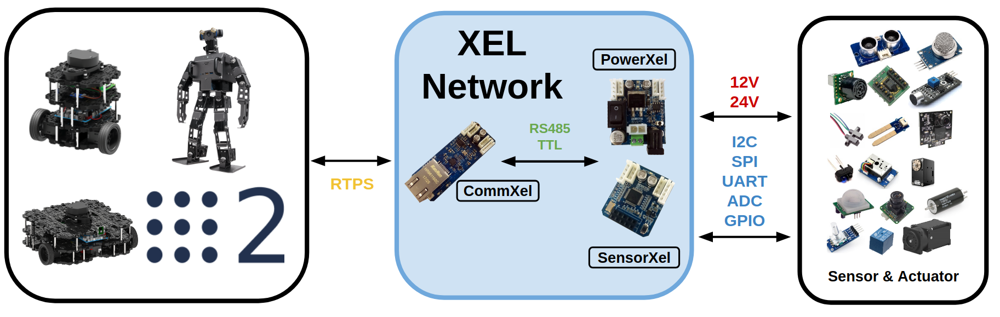
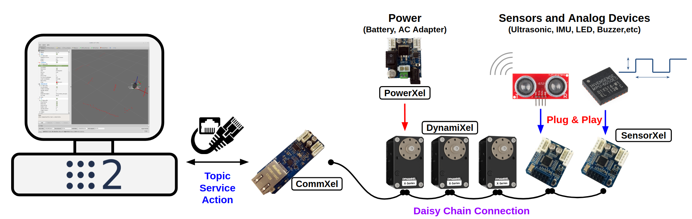
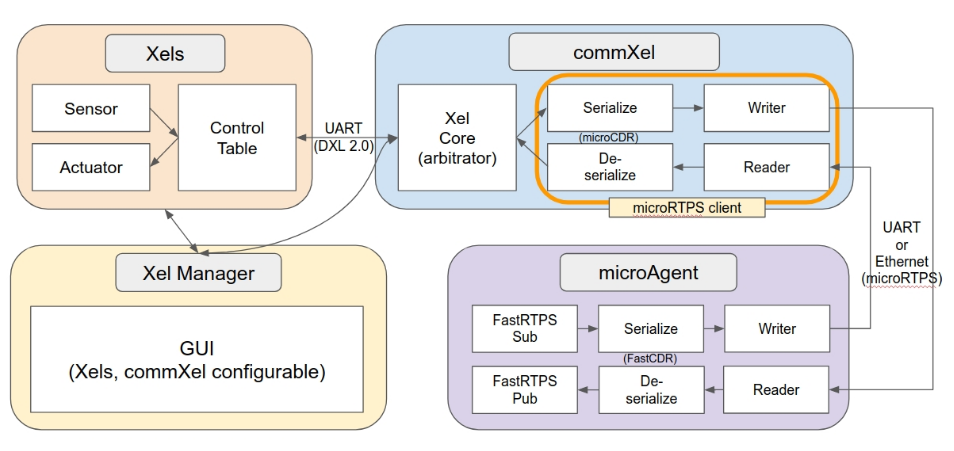

# XelNetwork

How to build modular H/W ecosystem over ROS 2.0 & DDS

## Concept
Robots are a collection of technologies ranging from **hardware to software**. So if someone wants to build a robot, they need people in various fields or people with that skill. In the software section, ROS is helping to solve this problem easily. So, what about the hardware? Due to ROS2.0 is designed to use DDS, we were able to find ways to **modularize hardware**. Especially, using the **actuator's protocol**, which is an important part of the robot, it is making the base for **transmitting/receiving data more easily with DDS**. There are three types of boards, one dedicated to sensor and power management, and one dedicated to communication with DDS, each of which is modularized.

## Description

The goals of this project are as follows.

- Generalization of Software Mechanism in Robot Development with Embedded Technology.
- Complete open source hardware.
- Simpler and easier robot development through the above goals.

In detail for “Generalization of the software mechanism”, by developing a mechanism for interconnection of hardware(especially circuit, firmware) and software(especially ROS) in robot development, users can use this mechanism to develop hardware/software so that it can be commercialized. Since this mechanism is not specific to any hardware, it can be **hardware-independent**.

In the case of “complete open source hardware”, we will **fully open all the information** (circuit diagram, artwork, firmware, software) about the hardware/software we have developed so that the user can understand the mechanism and freely modify and commercialize the hardware is.

We have done research on this, and we are still thinking about better directions and methods. Here are some of the technologies we see as key:

- **Sensing/control for embedded sensors/actuators** via communication protocols such as the **Dynamixel protocol**.
- **Communicate with ROS(DDS) through RTPS** supporting  **XRCE**(eXtremely Resource Constrained Environments) such as microRTPS.
- A core function to **arbitrate/control** between two above.
- **Plug and Play (PnP)**
- **Daisy Chain Connection**

We chose the **Dynamixel protocol** to sense from each embedded sensor or to control the actuator. Dynamixel can **control** the actuator and **read** the information(position, speed, etc.) of the actuator. Using the characteristics of these protocols, we have created a table in the firmware that can be accessed with this protocol, and using this table as a register allows the master to read and control the various information that the slave device has. If each slave device(in this case, the board to which the embedded sensor is connected or Dynamixel) has an independent ID, information about which sensor or which actuator is input, we can read the sensed data of each slave device or control those actuators.

To do this, we made a master board(called **CommXel**) that manages all these slave devices(called **SensorXel** or **PowerXel**), and this role becomes the core function of the board's firmware. The board must be able to communicate with the DDS for communication with the ROS, so **we used microRTPS in the firmware**. After all, the **core function** of this board is very important. The board must periodically **collect data(via the Dynamixel protocol) from embedded slave devices** and be able to **publish** via RTPS at specified intervals. Conversely, the board must be able to **subscribe** to specific topics to change the table value of each embedded slave device, or to control the actuator. Currently, we have completed testing for publishing or subscribing to simple Topic, and are working to make the APIs' design and software mechanism more flexible.

The **Plug and Play(PnP)** is a powerful feature. If you want to connect the IMU to the robot, how easy would it be if you could **just connect** the sensor board with the IMU sensor and see the data right on the ROS topic? Although there are limitations due to the physical characteristics of the hardware, we want to provide an environment that makes it easier to create robots through these solutions.

As another characteristic of our project, we have features that are based on **FreeRTOS**(Not NuttX) and **Non-OS** which are widely used in embedded, and we will release about 100 sets free of charge as open source hardware for beta tester. It will also be available on open platforms such as TurtleBot3, which will make it easier for users to test and discuss this solution.
