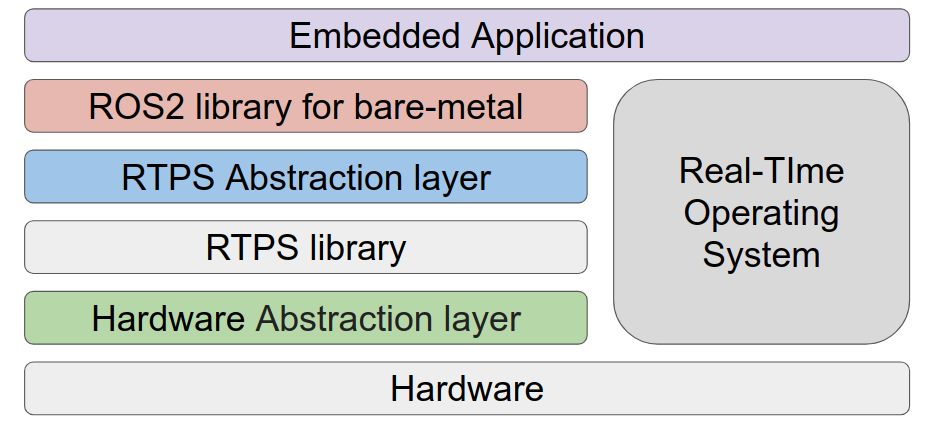
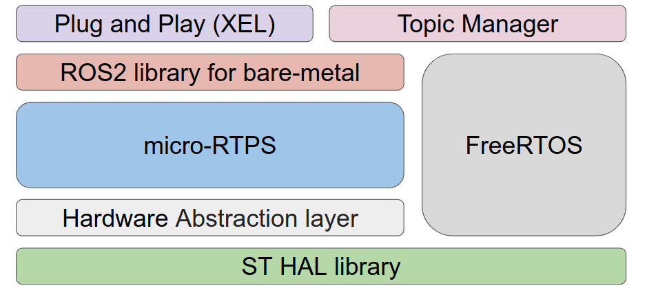

# OpenSource Software

## Git Repositories
- [CommXel](https://github.com/ROBOTIS-GIT/XelNetwork_CommXel)
- [SensorXel](https://github.com/ROBOTIS-GIT/XelNetwork_SensorXel)
- [PowerXel](https://github.com/ROBOTIS-GIT/XelNetwork_PowerXel)


<br>

## Develop Notes
#### Current Status

- Support only publisher & subscriber.
- Support only one topic per one xel.
- Support USB to DYNAMIXEL bypass on CommXel.
- Support basic message types.
- PlugAndPlay (You can limit the range of IDs to search for performance)

#### Plan
- Support service, action, parameter.
- More sophisticated real-time performance
- Supports various message types
- GUI program release
- Support IDE likes Arduino for user customizing for SensorXel.
- Support multi topics on one device.
- Improved performance.
- Clean code.

<br>

## Development
### Get Xel's source from git
```bash
$ cd && mkdir -p ~/workspace/source && cd ~/workspace/source
$ git clone --recursive https://github.com/ROBOTIS-GIT/XelNetwork_CommXel.git -b develop
$ git clone --recursive https://github.com/ROBOTIS-GIT/XelNetwork_SensorXel.git -b develop
$ git clone --recursive https://github.com/ROBOTIS-GIT/XelNetwork_PowerXel.git -b develop
```

### TrueStudio (IDE option #1)
- **Install TrueStudio**
Please refer to [this link](https://atollic.com/resources/download/) to install A

- **Import Xel's project to TrueStudio's workspace**
	- Click [File] - [Import..] on the top menu
	- Click [Existing Projects into Workspace] in [General], click [Next >] button.
		- Enter path as shown below.
		- Select root directory: ~/workspace/source
	- Select projects list below in [Projects:]
		- commXel_app    (in project/trueStudio)
		- commXel_boot  (in project/trueStudio)
		- sensorXel_app   (in project/trueStudio)
		- sensorXel_boot  (in project/trueStudio)
		- powerXel_app    (in project/trueStudio)
		- powerXel_boot   (in project/trueStudio)
	- Click [Finish]

### EclipseCDT (IDE option #2)
- **Dependencies**
	- JAVA JDK (openjdk or OracleJAVA)
	
- [**GNU ARM ToolChain**](http://gnuarmeclipse.github.io/toolchain/install/#gnulinux)
```bash
$ mkdir ~/tools && cd ~/tools
$ wget https://launchpad.net/gcc-arm-embedded/5.0/5-2016-q2-update/+download/gcc-arm-none-eabi-5_4-2016q2-20160622-linux.tar.bz2
$ tar -xvjf gcc-arm-none-eabi-5_4-2016q2-20160622-linux.tar.bz2
$ ./gcc-arm-none-eabi-5_4-2016q2/bin/arm-none-eabi-gcc --version
```

- [**OpenOCD**](http://gnuarmeclipse.github.io/openocd/install/)
	- Install OpenOCD
```bash
$ cd ~/tools
$ wget https://github.com/gnuarmeclipse/openocd/releases/download/gae-0.10.0-20170124/gnuarmeclipse-openocd-debian64-0.10.0-201701241841.tgz
$ tar xvf gnuarmeclipse-openocd-debian64-0.10.0-201701241841.tgz
$ ./openocd/0.10.0-201701241841/bin/openocd --version
$ sudo cp ./openocd/0.10.0-201701241841/contrib/60-openocd.rules /etc/udev/rules.d
$ sudo udevadm control --reload-rules
$ sudo udevadm trigger
```

- **Eclipse CDT**
	- [Download Eclipse CDT](http://www.eclipse.org/downloads/packages/release/photon/r/eclipse-ide-cc-developers)
	- Extract download file to the location you want.

- [**GNU ARM Eclipse Plugin**]((gnuarmeclipse.github.io/plugins/install/) )
	- Click [Help] - [Install New Software] on the top menu of Eclipse.
	- In the pop-up window, click [Add ... ] Button.
	- Enter the following in the [Add Repository] popup window.
		- Name : GNU ARM Eclipse Plug-ins
		- Location : http://gnuarmeclipse.sourceforge.net/updates
	- Check all and install GNU ARM C/C++ Cross Develoment Tools
	- When you install it, the warning "unsigned content" appears in the middle of the installation. If so, press the [OK] button to proceed with the installation.


- **Eclipse Setting**
	- Set Global Toolchain path
		- Click [Windows] - [Preferences] on the top menu
		- Click [C/C++] - [Build] - [Workspace Tools] on the left menu of the popup window
		- Enter Path as shown below.
			- Toolchain folder: ~/tools/gcc-arm-none-eabi-5_4-2016q2/bin		
	- Set OpenOCD path
		- Click [Windows] - [Preferences] on the top menu
		- Click [Run / Debug] - [OpenOCD] on the left menu of the popup window
		- Enter Path as shown below.
			- Executable: openocd
			- Folder: ~/tools/openocd/0.10.0-201701241841/bin
		- Click [Apply]
	- Set String Substitution for ExternalTool argument
		- Click [Windows] - [Preferences] on the top menu
		- Click [Run / Debug] - [String Substitution] on the left menu of the popup window
		- Click [New..] button and enter variable, value as shown below.
			- Name: COM_PORT
			- Value: /dev/ttyACM0
		
- **Import Xel's project to EclipseCDT's workspace**
	- Click [File] - [Import..] on the top menu
	- Click [Existing Projects into Workspace] in [General], click [Next >] button.
		- Enter path as shown below.
		- Select root directory: ~/workspace/source
	- Select projects list below in [Projects:]
		- commXel_app     (in project/eclipse)
		- commXel_boot   (in project/eclipse)
		- sensorXel_app    (in project/eclipse)
		- sensorXel_boot   (in project/eclipse)
		- powerXel_app     (in project/eclipse)
		- powerXel_boot    (in project/eclipse)
	- Click [Finish]

### Introducing source tree structure
 - common F/W architecture


 - commXEL F/W architecture


	
	
